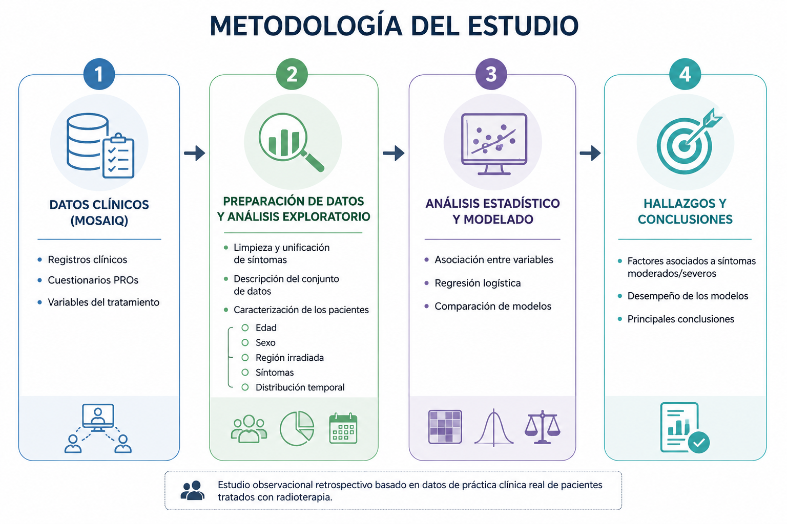
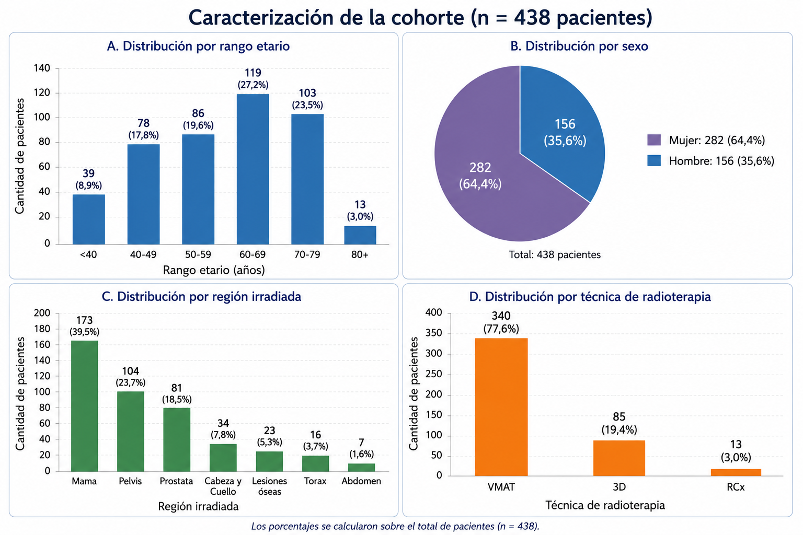

# Análisis de síntomas reportados por pacientes (PROs) durante tratamientos de radioterapia

Este repositorio contiene el código desarrollado en el marco del **Taller de Tesis** de la **Maestría en Ciencia de Datos** de la **Universidad de Buenos Aires (UBA)**.

El trabajo presenta un análisis de los **Patient Reported Outcomes (PROs)** registrados por pacientes durante tratamientos de radioterapia en un **centro de salud privado de Argentina**. A partir de estos reportes, se caracterizan los patrones de síntomas, su evolución a lo largo del tratamiento y los factores asociados con una mayor probabilidad de presentar síntomas moderados o severos.

---

## 🎯 Objetivo

Caracterizar los síntomas reportados por pacientes durante tratamientos de radioterapia a partir de cuestionarios **Patient Reported Outcomes (PROs)**, identificando patrones según la región anatómica irradiada, la evolución temporal del tratamiento y los factores asociados con una mayor probabilidad de presentar síntomas moderados o severos mediante técnicas de ciencia de datos.

---

## 🔬 Metodología del estudio

El análisis se desarrolló a partir de registros clínicos y cuestionarios **Patient Reported Outcomes (PROs)** obtenidos durante la práctica asistencial. La metodología combinó técnicas de preparación de datos, análisis exploratorio, modelado estadístico y aprendizaje automático para caracterizar los síntomas, analizar su distribución temporal e identificar factores asociados con una mayor probabilidad de presentar respuestas moderadas o severas. Finalmente, se incorporó un modelo longitudinal de efectos mixtos para considerar las mediciones repetidas de cada paciente.

El siguiente esquema resume las principales etapas desarrolladas durante el estudio.

<p align="center">
  
</p>

---

## 📊 Principales resultados

El análisis exploratorio permitió caracterizar la población de estudio y describir las principales variables demográficas y clínicas. La cohorte final estuvo compuesta por **438 pacientes** y **24.799 respuestas**, correspondientes a **28 síntomas unificados**, registradas durante el seguimiento de los tratamientos de radioterapia. El **78,5% de los pacientes** presentó al menos una respuesta correspondiente a un síntoma clasificado como moderado o severo.

La siguiente figura resume las principales características de la cohorte analizada, incluyendo la distribución por rango etario, sexo, región anatómica irradiada y técnica de tratamiento.

<p align="center">
  
</p>

El análisis permitió identificar **perfiles sintomáticos diferenciados según la región anatómica irradiada**, así como síntomas presentes de manera transversal en distintas regiones. Asimismo, se observó un patrón temporal en la severidad, con una mayor proporción de respuestas moderadas o severas entre los **30 y 60 días** desde el inicio del tratamiento.

<p align="center">
  
</p>

Mediante regresión logística se analizaron los factores asociados con la probabilidad de registrar respuestas moderadas o severas. El tipo de síntoma y el tiempo transcurrido desde el inicio del tratamiento concentraron las principales asociaciones, mientras que la técnica de radioterapia y el número de sesiones no mostraron asociaciones estadísticamente significativas.

Finalmente, se incorporó un **modelo lineal generalizado mixto (GLMM)** con intercepto aleatorio por paciente para considerar la estructura longitudinal y la dependencia entre mediciones repetidas. El modelo presentó un **ICC de 0,332** en escala latente y mantuvo una asociación significativa para el período comprendido entre los **31 y 60 días** respecto de los primeros 30 días (OR=1,95; IC95%: 1,73–2,19). Estos resultados muestran la relevancia de considerar la heterogeneidad entre pacientes al analizar la evolución de la severidad durante el tratamiento.

---

## 📁 Estructura del repositorio

```text
analisis-radioterapia-pros/
│
├── README.md
├── Análisis de Radioterapia.ipynb
└── figures/
    ├── metodologia.png
    ├── resumen.png
    └── heatmap.png
```

---

## 🛠️ Tecnologías utilizadas

- Python
- R
- Jupyter Notebook / Google Colab
- Pandas
- NumPy
- Matplotlib
- Scikit-learn
- Statsmodels
- glmmTMB

---

## 🔒 Disponibilidad de los datos

Los datos utilizados en este proyecto corresponden a registros clínicos provenientes del sistema **MOSAIQ (Elekta)** de un centro de salud privado de Argentina. Debido a que contienen información sensible de pacientes, no pueden ser compartidos públicamente. Este repositorio incluye el código desarrollado y las principales visualizaciones obtenidas durante el estudio.

---

## 👨‍💻 Autor

**Juan José López**

Taller de Tesis – Maestría en Ciencia de Datos  
Universidad de Buenos Aires (UBA)

---

## 📖 Citación

Si este repositorio resulta de utilidad para trabajos académicos o de investigación, se agradece citar este proyecto y su correspondiente trabajo de tesis.
